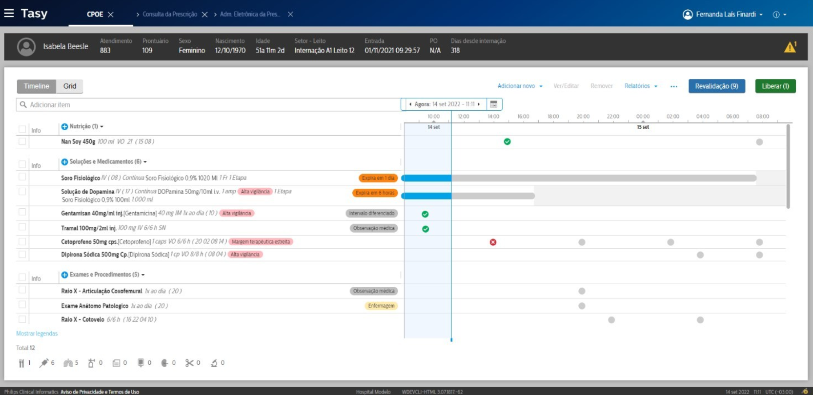
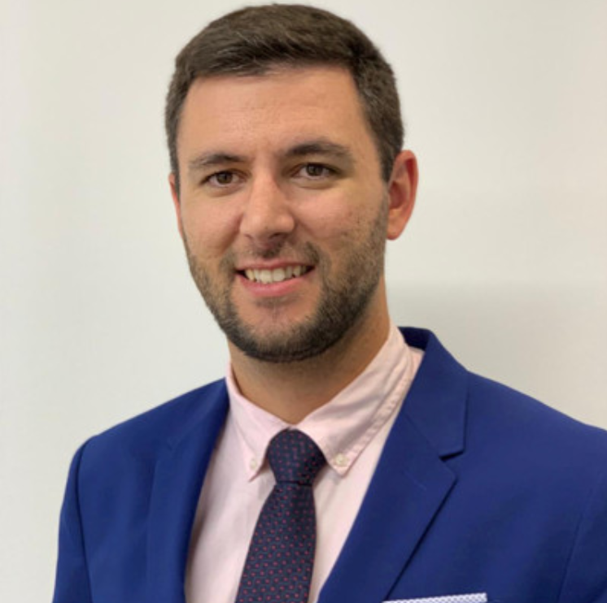
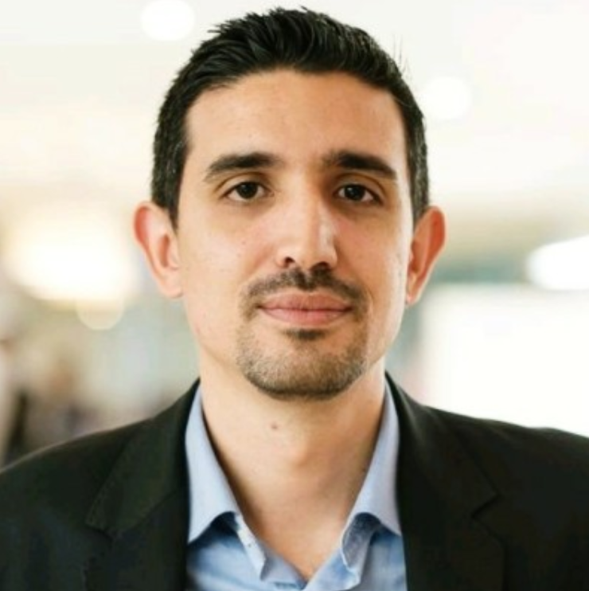

# Como foi trabalhar na multinacional Philips

*"A Philips mudou minha vida profissional e pessoal, gratidão."*

*Amanda Segundo*

## [Entra21](https://www.entra21.com.br/): a porta de entrada

O programa Entra21 oferece bolsas de formação em TI para jovens. Ele é financiado pelo governo do estado de Santa Cataria e pela prefeitura de Blumenau, possui como investidores várias empresas grandes de Blumenau.

Consegui uma bolsa em 2015 no Entra21 para estudar Android. O curso me ajudou a intensificar meus conhecimentos em lógica de programação, banco de dados e Java.

O professor [Sérgio Rafael Siewerdt](https://www.linkedin.com/in/sergiorafael/) ministrava aulas de Desenvolvimento Humano, foi ele quem me apresentou a Philips e o processo seletivo que estava acontecendo na época.

O Professor Sérgio:

## [Agência Selecionar Talentos](https://gruposelecionar.com.br/)

Na época a contratação e o processo seletivo estava nas mãos da Selecionar Talentos, que hoje pertence ao Grupo Selecionar.

Quem passasse no processo seletivo ganhava uma formação em Java na escola [Proway](https://www.proway.com.br/) e já poderia entrar efetivado ou com a chance de ser efetivado.

Eu ganhei apenas o curso de formação inicialmente.

### Processo seletivo

Lembro que foram várias etapas e entrevistas, dentre elas haviam provas de lógica e matemática.

## Formação em Java

O curso foi ministrado pelo professor [Felipe da Rosa Oliveira](https://www.linkedin.com/in/felipe-da-rosa-oliveira/) e dentre as disciplinas haviam JavaScript, AngulasJS, WebServices, JavaWeb e SQL.

O professor Felipe:

## Contratação

Quando finalizei o curso de formação em Java fui contratada pela diretora da Philips [Ana Cristina Gozdziejewski](https://www.linkedin.com/in/anagozdziejewski/) para o cargo de Programadora Trainee.

A diretora Ana:

### Integração

Lembro do meu primeiro dia na Philips, quem recebeu meus documentos de RH, quem me apresentou às instações da Philips e fez a minha integração foi a [Tauana Eloá Dias](https://www.linkedin.com/in/tauana-elo%C3%A1-dias-86547210b/).

A Tauana:

💡 [Conheça o podcast da Tauana: Amigaterapia](https://www.youtube.com/@AmigaterapiaPodcast)

## O que é o Tasy

O Tasy é um ERP (Sistema Integrado de Gestão Empresarial) para hospitais.

💡 [Mais sobre o Tasy](https://www.philips.com.br/c-dam/b2bhc/br/resource-catalog/landing/tasy_category/folder-tasy-prestador-br.pdf)

## CPOE: O primeiro projeto

A CPOE (Computerized Physician Order Entry) é uma função do Tasy onde o médico faz as prescrições para um paciente.

O projeto da CPOE se tratava de uma migração das tecnologias Java Swing Desktop, Delphi Desktop e GWT para a tecnologia Tasy Web HTML5.

A CPOE (fonte: Internet)

💡 [Mais sobre uma CPOE](https://en.wikipedia.org/wiki/Computerized_physician_order_entry)

💡 [GWT - Google Web Toolkit](https://pt.wikipedia.org/wiki/Google_Web_Toolkit)

O meu gerente na época era o [Rafael Caldas](https://www.linkedin.com/in/rafael-caldas-84024a47/), ele foi responsável também por gerenciar as localizações do Tasy em vários países da América do Sul e Central.

O Rafael:

### Padrinho

Todos os programadores iniciantes são acompanhados por um "padrinho" ou "madrinha".

O meu padrinho era o [Daniel Galvan](https://www.linkedin.com/in/daniel-galvan1989/), ele me apresentou o Tasy, me ensinou boas práticas de desenvolvimento e me auxiliou por uns 3 meses, assim não tive tanta dificuldade em trabalhar no sistema.

O Daniel:

### Primeira analista de sistema que conheci

A [Susan Braun Rosa](https://www.linkedin.com/in/susan-braun-rosa-49375279/) foi a primeira analista de sistema com quem trabalhei, ela possuia muitos conhecimentos de negócio e conhecimentos técnicos. Aprendi muito sobre Java e análise de requisitos com ela.

💡 [Análise de sistemas](https://pt.wikipedia.org/wiki/An%C3%A1lise_de_sistemas)

## HTML5: O segundo projeto

O projeto HTML5 se tratava de outra migração do Tasy, tecnologias Java Swing e Delphi para Web HTML5, foi um projeto bem grande e havia muitos programadores e analistas de sistemas envolvidos.

Migrei muitas funções de várias áreas do sistema, incluido contabilidade e administração de medicamentos.

💡 [Mais sobre o projeto HTML5](https://images.philips.com/is/content/PhilipsConsumer/Campaigns/HC20140401_DG/Documents/it-magazine-8.pdf)

## Alemanha: Primeira localização

Antes de entrar em detalhes, é necessário saber o que é uma internacionalização e localização de um sistema de Software: são processos de desenvolvimento ou adapção de um software para atender o idioma, cultura e legislação de um país.

💡 [Internacionalização (informática)](https://pt.wikipedia.org/wiki/Internacionaliza%C3%A7%C3%A3o_(inform%C3%A1tica))

Assim que o projeto HTML5 terminou eu fui selecionada para trabalhar no projeto de Localização da Alemanha, muitas funções precisaram ser adptadas ao mercado alemão e outras deveriam ser criadas.

Meu gestor era o Pedro Andrade, ele também cuidou das localizações da Austria e Arábia Saudita e também era o DPO (Data Protection Officer). O Pedro era o tipo de gestor que ajudava você até depurarando um código.

O Pedro:

Bandeira da Alemanha:

### Funções marcantes

#### PEP

#### Agendas

#### Panorâma Clínico

### Design do Tasy

####  Caio Badu Nishihara de Albuquerque

### eGK: O cartão do "SUS" alemão

#### Thomas Brian Schulz

#### Ricardo Pereira dos Santos

### Trabalhando com colegas indianos

### Outras Localizações

## Localização Japão

## Multiplicadora da Qualidade

