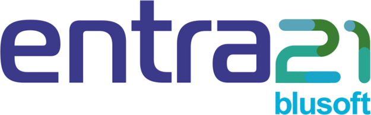
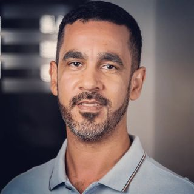
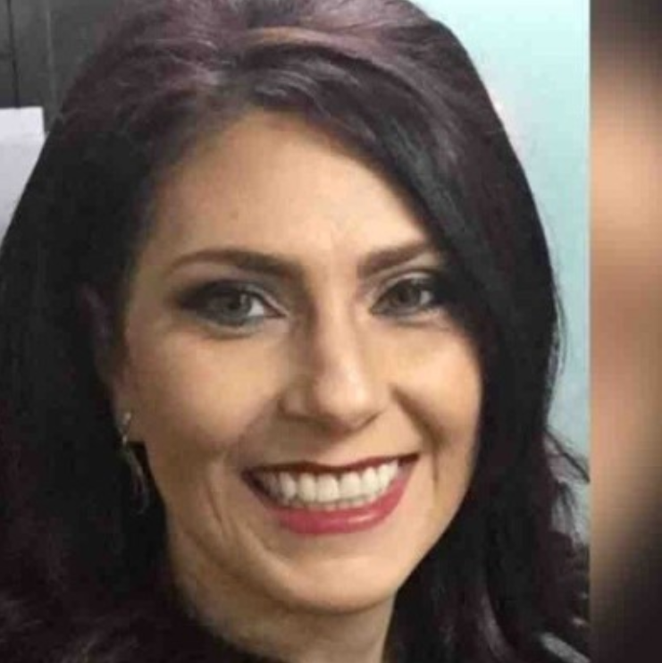

# Como foi trabalhar na multinacional Philips

*"A Philips mudou minha vida profissional e pessoal, gratidão."*

*Amanda Segundo*

## [Entra21](https://www.entra21.com.br/): a porta de entrada

O programa Entra21 oferece bolsas de formação em TI para jovens. Ele é financiado pelo governo do estado de Santa Cataria e pela prefeitura de Blumenau, possui como investidores várias empresas grandes de Blumenau.

Consegui uma bolsa em 2015 no Entra21 para estudar Android. O curso me ajudou a intensificar meus conhecimentos em lógica de programação, banco de dados e Java.

O professor [Sérgio Rafael Siewerdt](https://www.linkedin.com/in/sergiorafael/) ministrava aulas de Desenvolvimento Humano, foi ele quem me apresentou a Philips e o processo seletivo que estava acontecendo na época.

O Professor Sérgio:

## [Agência Selecionar Talentos](https://gruposelecionar.com.br/)

Na época a contratação e o processo seletivo estava nas mãos da Selecionar Talentos, que hoje pertence ao Grupo Selecionar.

Quem passasse no processo seletivo ganhava uma formação em Java na escola [Proway](https://www.proway.com.br/) e já poderia entrar efetivado ou com a chance de ser efetivado.

Eu ganhei apenas o curso de formação inicialmente.

### Processo seletivo

Lembro que foram várias etapas e entrevistas, dentre elas haviam provas de lógica e matemática.

## Formação em Java

O curso foi ministrado pelo professor [Felipe da Rosa Oliveira](https://www.linkedin.com/in/felipe-da-rosa-oliveira/) e dentre as disciplinas haviam JavaScript, AngulasJS, WebServices, JavaWeb e SQL.

O professor Felipe:

## Contratação

Quando finalizei o curso de formação em Java fui contratada pela diretora da Philips [Ana Cristina Gozdziejewski](https://www.linkedin.com/in/anagozdziejewski/) para o cargo de Programadora Trainee.

A diretora Ana:

### Integração

Lembro do meu primeiro dia na Philips, quem recebeu meus documentos de RH, quem me apresentou às instações da Philips e fez a minha integração foi a [Tauana Eloá Dias](https://www.linkedin.com/in/tauana-elo%C3%A1-dias-86547210b/).

A Tauana:

💡 [Conheça o podcast da Tauana: Amigaterapia](https://www.youtube.com/@AmigaterapiaPodcast)

## O que é o Tasy

## CPOE: Primeiro projeto

### Rafael Caldas

### Daniel Galvan

### Susan Braun Rosa

## Migrações: Segundo projeto

## Localização Alemanha

### Pedro Andrade

### Funções marcantes do Tasy

#### PEP

#### Agendas

#### Panorâma Clínico

### Design do Tasy

####  Caio Badu Nishihara de Albuquerque

### eGK: O cartão do "SUS" alemão

#### Thomas Brian Schulz

#### Ricardo Pereira dos Santos

### Trabalhando com colegas indianos

### Outras Localizações

## Localização Japão

## Multiplicadora da Qualidade

